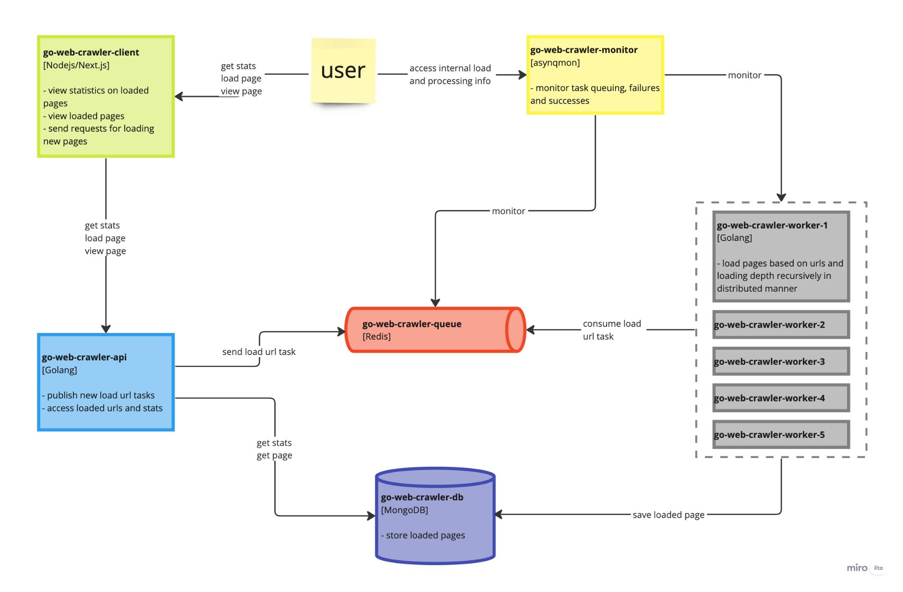

# Go Web Crawler

## Задача

**Функционально**:

- Веб краулер должен уметь рекурсивно выгружать содержание HTML страниц в
некоторый persistent store на основе параметров - URL начальной страницы и
глубины выгрузки.

**Нефункционально**:

- Выгрузка должна осуществляться асинхронно
(distributed manner)
- Компоненты отвечающие за выгрузку должны быть горизонтально
масштабируемы
- Решение должно быть дешевым и основываться на открытых
инструментах

## ADR

- Выгрузка страниц планируется посредством некоторой очереди сообщений и
  выгружается простыми воркерами
- Планирование выгрузки осуществляется посредством веб-сервиса
- Персистентное хранилище страниц может быть не транзакционным

Как следствие:

- Golang для API
- Golang/[Asynq](https://github.com/hibiken/asynq) для worker’ов выгружающих страницы
- [Redis](https://redis.io/) как очередь сообщений (следствие из asynq)
- [MongoDB](https://www.mongodb.com/) как БД для страниц
- Клиентский интерфейс на [Next.js](https://nextjs.org/) для удобства взаимодействия
- [Asynqmon](https://github.com/hibiken/asynqmon) для мониторинга (следствие из
  asynq)

### Схема компонент

